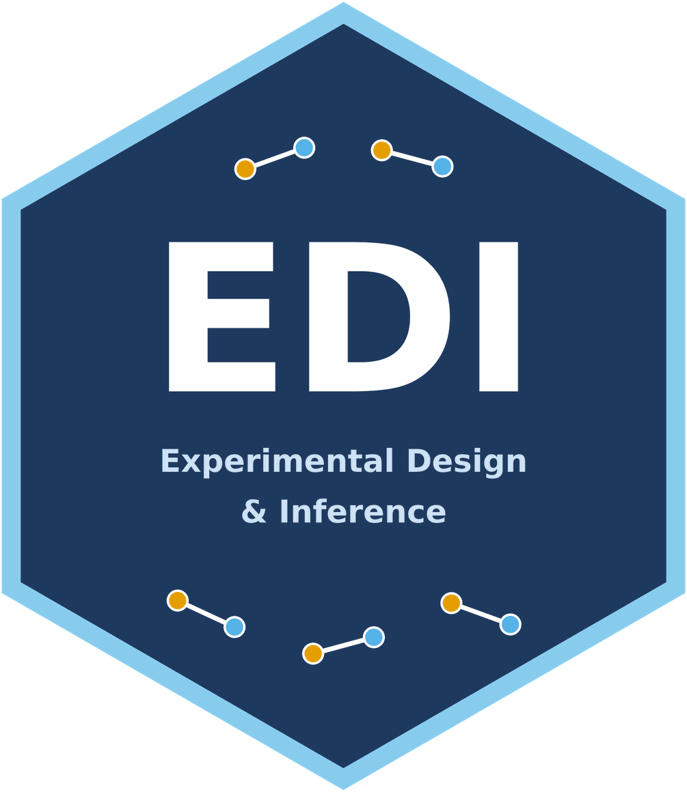

# EDI: Experimental Design and Inference 

[](https://CRAN.R-project.org/package=EDI)
[](https://kapelner.r-universe.dev/EDI)
[](https://github.com/kapelner/EDI/actions/workflows/R-CMD-check.yaml)
[](https://app.codecov.io/gh/kapelner/EDI/flags/r)
[](https://www.gnu.org/licenses/gpl-3.0)
[](https://doi.org/10.5281/zenodo.22170035)

`EDI` (Experimental Design and Inference) marries experimental designs (fixed
and sequential) with inference procedures (exact, asymptotic, and
distribution-free) tailored to each design and response type: continuous,
incidence, count, proportion, survival with left/right censoring, and ordinal.
Designs, inference, and Monte Carlo simulation are exposed as R6 classes; the
core estimation and variance-computing kernels are written in C++ (Eigen +
LBFGS++) for speed.

EDI is not related to Electronic Data Interchange (the business-document
exchange standard) or to equity, diversity, and inclusion; it is a statistics
package for the design and analysis of randomized experiments.

## Installation

Requires R >= 3.5.0 (R >= 4.0.0 recommended for best performance — newer
Rtools toolchain on Windows, interpreter-side speedups). Install the
released version from [CRAN](https://CRAN.R-project.org/package=EDI):

```r
install.packages("EDI")
```

Prebuilt binaries of the latest tagged release (Linux, macOS, and Windows, no
compiler toolchain needed) are also available from Adam Kapelner's
[R-universe](https://kapelner.r-universe.dev):

```r
install.packages(
  "EDI",
  repos = c(
    kapelner = "https://kapelner.r-universe.dev",
    CRAN = "https://cloud.r-project.org"
  )
)
```

Or install the development version straight from GitHub without cloning
(requires a C++ compiler toolchain for R packages, e.g. Rtools on Windows,
Xcode command line tools on macOS, or `r-base-dev` on Debian/Ubuntu — this
package lives in the `R/EDI` subdirectory of the repository). Building from
source like this (or from a local clone, below) automatically compiles with
your machine's native CPU optimizations (`-march=native`, `-O3`) for extra
speed — no flags to set yourself. The CRAN and R-universe installs above use
a portable build instead, since those binaries have to run on hardware they
were never compiled on:

```r
remotes::install_github("kapelner/EDI", subdir = "R/EDI")
```

Or from a local clone:

```r
# from the repository root
install.packages("R/EDI", repos = NULL, type = "source")
```

## Getting started

```r
library(EDI)
vignette("reproducibility", package = "EDI")      # RNG/seed conventions across designs, bootstrap, and simulation
vignette("extending-edi", package = "EDI")        # writing your own Design/Inference R6 subclasses
vignette("backend-contracts", package = "EDI")    # how the C++ core is shared between the R (Rcpp) and Python (pybind11) bindings
vignette("notation-glossary", package = "EDI")    # symbols/naming conventions shared across Design*/Inference* classes and docs
vignette("validation-evidence", package = "EDI")  # index into the test suite showing each model family computes what it claims
```

See the [repository README](https://github.com/kapelner/EDI#readme) for
worked examples (fixed and sequential designs, the inference suite, design
bakeoffs via `SimulationFramework`), local performance tuning, and the
companion Python package `edi_kernels`.
